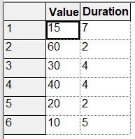
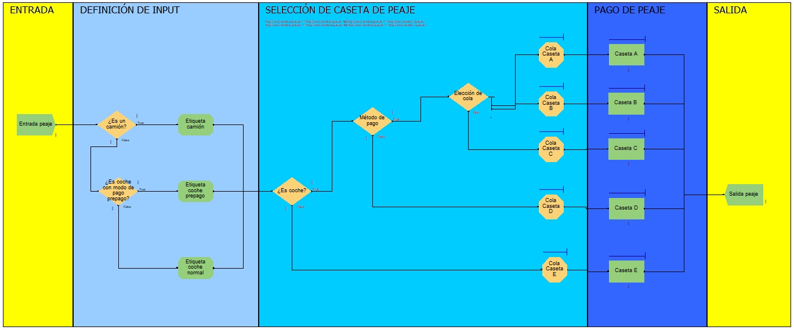
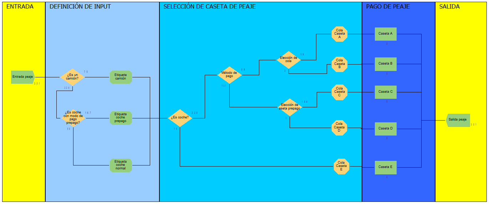

# Simulación de peaje

Modelos simplificados del sistema de peaje de una autopista implementados con el software de 
simulación Arena. 

## DESCRIPCIÓN
Se han elaborado dos modelos que simulan diferentes distribuciones de casetas de peaje. Con ello,
buscamos discutir cual es la mejor organización ante tres composiciones de usuarios. 

Por tanto, se simula un peaje en el que circulan coches y camiones con dos modalidades de pago, prepago
y pago normal. El método de pago prepago, implica un pago más rapido en comparación con el pago normal. 
Para realizar el pago se dispone de 5 casetas de peaje.

Los casos a evaluar son:
- Caso C1:
    - 1 de cada 4 coches disponen de prepago
- Caso C2:
    - 1 de cada 2 coches disponen de prepago
- Caso C3: 
    - 3 de cada 4 coches disponen de prepago.

Estos casos se evaluan con dos distribuciónes:
- Modelo A
    - 3 puestos para pago normal de coches
    - 1 puesto para coches prepago
    - 1 puesto para camiones
- Modelo B  
    - 2 puestos para pago normal de coches
    - 2 puestos para coches prepago
    - 1 puesto para camiones  

> [!NOTE]
> Aunque sería interesante evaluar más distribuciones no es el objetivo del proyecto y se 
> busca limitar el alcance de este.

Destacamos que se han definido franajas horarias con distintas distribuciones de llegada para hacer más 
realista el modelo. 



## MODELOS
Los modelos desarrollados se muestran en las siguientes imagenes: 

### Modelo A


### Modelo B


### Hipotesis general

Para desarrollar el modelo dentro de las limitaciones de información y la versión de arena disponible
se han asumido las siguientes hipotesis: 
- La distribución de llegadas toma la forma de una distribución exponencial de media 1. 
- La casetas de peaje atendidas por agentes comerciales siguen una distribución normal que varia entre
caseta. 
- Las llegadas al peaje varian según la franaja horaria.
- La distribución de tipo de vehiculo no varia con el tiempo. 

> [!NOTE]
> Estas hipotesis se basan en bases de datos públicas del Ministerio de Transporte. 

## ESTRCUTURA DEL REPOSITORIO
El repositorio contiene los siguientes ficheros organizados en el siguiente arbol de ficheros:
```
|_./
  |_README.md
  |_Modelo_A/
    |_Modelo_A.doe
    |_REPORTS/
      |_Modelo_A_rpt_C1.xlsm
      |_Modelo_A_rpt_C2.xlsm
      |_Modelo_A_rpt_C3.xlsm
  |_Modelo_B/
    |_Modelo_B.doe
    |_REPORTS/
      |_Modelo_B_rpt_C1.xlsm
      |_Modelo_B_rpt_C2.xlsm
      |_Modelo_B_rpt_C3.xlsm
  |_Imagenes/
    |_...
```
Las carpetas Modelo_X/ encapsulan el modelo y los resultados correspondientes. 

Por otra parte, la carpeta imagenes contiene algunas imagenes reseñables sobre los modelos elaborados.                
## INSTALACIÓN
Para poder visualizar y simular los modelos desarrollados es necesarios 
disponer del software de simulación [Arena Simulation Software](https://www.rockwellautomation.com/es-es/products/software/arena-simulation.html).
Además, para visualizar los informes de resultados es necesario disponer del software [Excel](https://www.microsoft.com/es-es/microsoft-365/excel).

Disponiendo de dicho software es posible descargar de este repositorio los ficheros
Modelo_A.doe y Modelo_B.doe y abrirlos con la aplicación Arean Simulation Software. 

> [!CAUTION]
> Este repositorio constituye un archivo de caso de uso del software Arena Simulation. En ningún caso se 
> recomienda el uso de este modelo fuera del ámbito educativo.  
